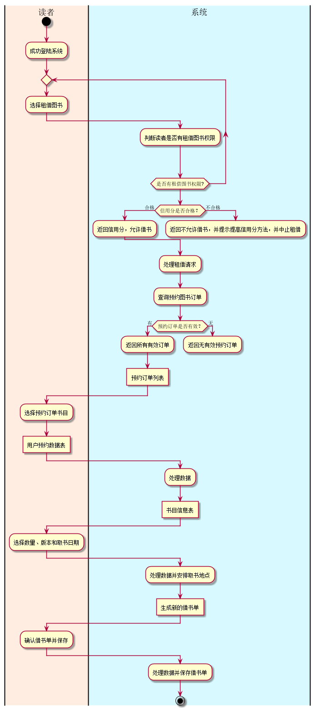
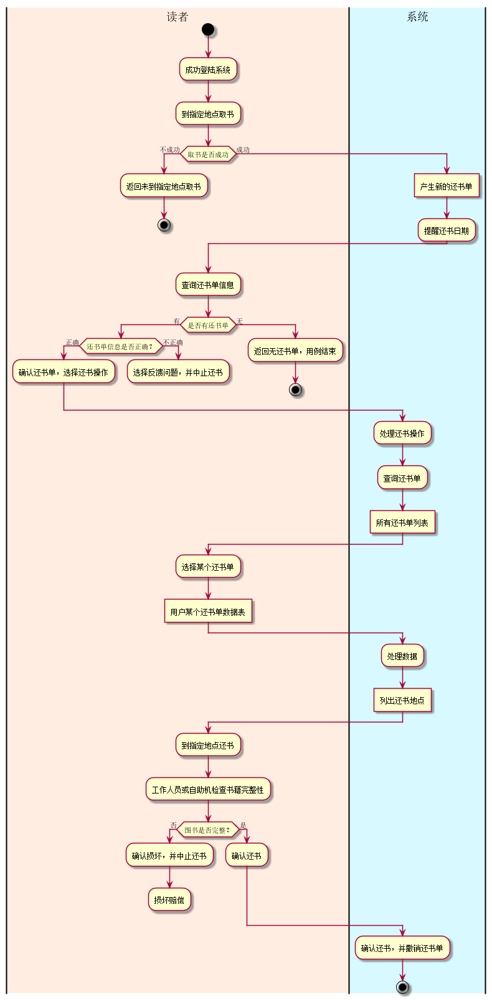

# 实验2：图书管理系统用例建模
|学号|班级|姓名|
|:-------:|:-------------: | :----------:|
|201510414109|软件(本)15-1|郭钊彬|

## 1. 图书管理系统的用例关系图

### 1.1 用例图PlantUML源码如下：

``` usecase
@startuml
top to bottom direction
skinparam packageStyle rectangle
actor 系统管理员 as administrator
actor 图书管理员 as librarian
actor 读者 as reader
actor 游客 as visitor

visitor <|- reader
librarian <|- administrator

rectangle  {
    left to right direction
 	(查询个人信息) <- reader
 	(查询借阅信息) <- reader
 	(预定图书) <- reader
 	(取消预定) <- reader
 	(租借图书) <- reader
 	(归还图书) <- reader
 	(查询图书信息) <- reader

 	(查询图书信息) <- visitor

    (预定图书) .> (取消预定) : extends
    (租借图书) .> (归还图书) : extends
    (归还图书) .> (违约罚款) : include

 }

rectangle  {
    left to right direction
	administrator -right-> (添加读者)
	administrator -right-> (删除读者)
	administrator -right-> (修改读者信息)
	administrator -right-> (添加图书管理员)
	administrator -right-> (删除图书管理员)
	administrator -right-> (修改图书管理员)

	librarian -right-> (处理借书)
	librarian -right-> (处理还书)
	librarian -right-> (添加图书)
	librarian -right-> (删除图书)
	librarian -right-> (维护读者信息)

    (添加读者) .> (删除读者) : extends
    (添加读者) .> (修改读者信息) : extends
    (添加图书管理员) .> (删除图书管理员) : extends
    (添加图书管理员) .> (修改图书管理员信息) : extends
    (添加图书) .> (删除图书) : extends

}

	(图书管理) <.left. (添加图书) : extends
	(图书管理) .left.> (删除图书) : include
	(图书管理) .left.> (处理借书) : include
	(图书管理) .left.> (处理还书) : include
	(图书管理) .> (查询图书信息) : include
	(图书管理) .> (查询借阅信息) : include
	(图书管理) .> (租借图书) : include
	(图书管理) .> (归还图书) : include

	(读者管理) <.left. (添加读者) : extends
	(读者管理) .left.> (删除读者) : include
	(读者管理) .left.> (修改读者信息) : include
	(读者管理) .left.> (维护读者信息) : include
	(读者管理) .> (查询个人信息) : include

	(图书管理员管理) <.left. (添加图书管理员) : extends
	(图书管理员管理) .left.> (删除图书管理员) : include
	(图书管理员管理) .left.> (修改图书管理员信息) : include

skinparam handwritten true
skinparam usecase {
	BackgroundColor YellowGreen
	BorderColor DarkSlateGray
	ArrowColor Olive
	ActorBorderColor black
	ActorFontName Courier

}

@enduml
```


### 1.2. 用例图如下：


## 2. 参与者说明：

###     2.1 系统管理员

主要职责是：

    	读者管理：
    		添加读者
    		删除读者
    		修改读者信息
    		
    	图书管理员管理：
    		添加图书管理员
    		删除图书管理员
    		修改图书管理员信息

###     2.2 图书管理员

主要职责是：

    	图书管理：
    		添加图书
    		删除图书
    		处理借书
    		处理还书
    	读者管理（拥有系统管理员部分权限）：
    	    维护读者信息

###     2.3 读者

主要职责是：

    	读者管理：
    	    查询个人信息
    	图书管理：
    		查询图书信息
    		查询借阅信息
    		预定图书
    		取消预定
    		租借图书
    		归还图书
    		    违约罚款

###     2.4 游客
    
主要职责是：
        
        查询图书信息

##     3. 用例规约表

###    3.1 “租借图书”用例

####   3.1.1“租借图书”用例规约

|用例名称|租借图书|
|:-----------:|:-----------------------:|
|参与者|读者|
|前置条件|读者登录到系统，预定图书成功|
|后置条件|产生新的借书单并储存，租借图书成功|
|主事件流|
|参与者动作|系统行为|
|<br>2.读者选择需要租借的书目<br>4.读者选择图书版本和数量并指定取书日期<br><br><br>7.读者确认借书单并保存|1.系统列出该读者经手预定成功的所有书目名称<br>3.系统显示该书目的基本信息和租借情况<br>5.系统列出指定日期读者取书的地点<br>6.系统生成借书单<br>8.系统保存借书单，用例结束|
|备选事件流|
|1a.无预定图书订单<br>1.系统提示无预定图书订单，用例结束|
|业务规则|
|1.一个读者可以选择租借多本图书；<br>2.读者无不良记录，有借书权限；<br>3.每个借书单包括版本、数量、价格、借出日期、取书地点等类型。|

####   3.1.2“租借图书”用例流程图源码如下：
~~~
@startuml

|#ffede1|读者|
start
    :成功登陆系统;
    repeat
        :选择租借图书;
    	|#D7F9FF|系统|
    	:判断读者是否有租借图书权限;
    repeat while (是否有租借图书权限?)
    |系统|
    if (信用分是否合格？) then (合格)
    	:返回信用分，允许借书;
    else(不合格)
    	:返回不允许借书，并提示提高信用分方法，并中止租借;
    	detach
    endif
    |系统|
    :处理租借请求;
	:查询预约图书订单;
    if (预约订单是否有效？) then (有)
	    :返回所有有效订单;
	    :预约订单列表]
    else(无)
	     :返回无有效预约订单;
	     detach
    endif
         |读者|
         :选择预约订单书目;
         :用户预约数据表]
         |系统|
	    :处理数据;
	    :书目信息表]
         |读者|
         :选择数量、版本和取书日期;
         |系统|
	    :处理数据并安排取书地点;
	    :生成新的借书单]
         |读者|
         :确认借书单并保存;
         |系统|
	    :处理数据并保存借书单;
stop

@enduml
~~~

####   3.1.3“租借图书”用例流程图如下：



###    3.2 “归还图书”用例

####   3.2.1“归还图书”用例规约


|用例名称|归还图书|
|:-----------:|:-----------------------:|
|参与者|读者|
|前置条件|读者登录到系统，租借图书成功|
|后置条件|产生新的还书单并储存，归还图书成功|
|主事件流|
|参与者动作|系统行为|
|1.读者已到取书地点取书成功<br>3.读者选择还书模块<br>5.读者选择需要归还的图书的还书单<br>7.读者到指定地点还书并由管理员或自助机确认|<br>2.系统产生新的还书单并提醒下次还书的日期<br>4.系统列出所有还书清单<br>6.系统列出读者还书的地点<br>8.系统确认还书并撤销还书单，用例结束|
|备选事件流|
|1a.读者未到取书地点取书  1.系统提示未成功取书，用例结束<br>4a.系统无还书单  4.系统提示无还书单，用例结束|7a.读者未到还书地点还书  7.系统提示还书失败，并生成违约罚款单，提示下次还书日期和地点，用例结束|
|业务规则|
|1.一个读者可以选择归还多本图书；<br>2.读者未按规定时间还书将罚款并扣除信用分；<br>3.每个还书单包括版本、数量、价格、借出日期、取书地点等类型。<br>4.信用分低将不能租借图书|

####   3.2.2“归还图书”用例流程图源码如下：
~~~
@startuml

|#ffede1|读者|
start
    :成功登陆系统;
    :到指定地点取书;
    if (取书是否成功) then(不成功)
        :返回未到指定地点取书;
        stop
    else(成功)
        |#D7F9FF|系统|
        :产生新的还书单]
    	:提醒还书日期;
    endif
        |读者|
	    :查询还书单信息;
	    if (是否有还书单) then (有)
            if (还书单信息是否正确？) then (正确)
    	        :确认还书单，选择还书操作;
            else(不正确)
    	        :选择反馈问题，并中止还书;
    	        detach
            endif
    	else(无)
            :返回无还书单，用例结束;
            stop
    	endif
    |系统|
    :处理还书操作;
	:查询还书单;
	:所有还书单列表]
    |读者|
    :选择某个还书单;
    :用户某个还书单数据表]
    |系统|
	:处理数据;
	:列出还书地点]
    |读者|
    :到指定地点还书;
    :工作人员或自助机检查书籍完整性;
    if (图书是否完整？) then (否)
    	:确认损坏，并中止还书;
    	:损坏赔偿;
    	detach
    else(是)
    	:确认还书;
    endif
    |系统|
    	:确认还书，并撤销还书单;
stop

@enduml
~~~

####   3.2.3“归还图书”用例流程图如下：

       


###    3.3 “查询借阅信息”用例

####   3.3.1“查询借阅信息”用例规约

|用例名称|查询借阅信息|
|:-----------:|:-----------------------:|
|参与者|读者|
|前置条件|读者登录到系统|
|后置条件|列出新的查询借阅信息列表|
|主事件流|
|参与者动作|系统行为|
|1.读者成功登陆系统<br>3.读者选择个人模块<br>5.读者选择查询借阅信息模块<br>7.读者选择需要查看的某个图书借阅的信息|<br>2.系统显示首页<br>4.系统显示读者个人模块所有信息<br>6.系统列出读者所有借阅信息<br>8.系统列出详细借阅信息，用例结束|
|备选事件流|
|6a.无借阅信息<br>1.系统提示无借阅信息，用例结束|
|业务规则|
|1.一个读者只有一个账户；<br>2.一个读者可以有多份借阅信息。|
