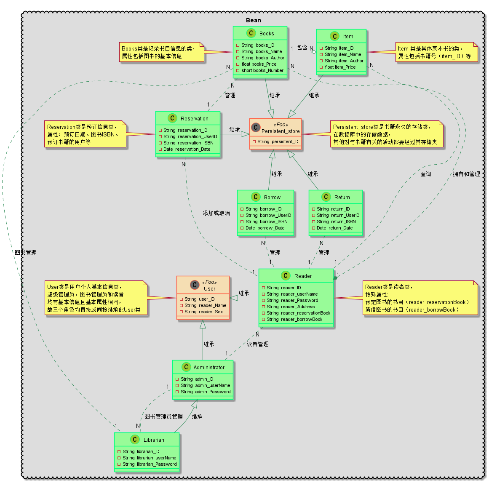
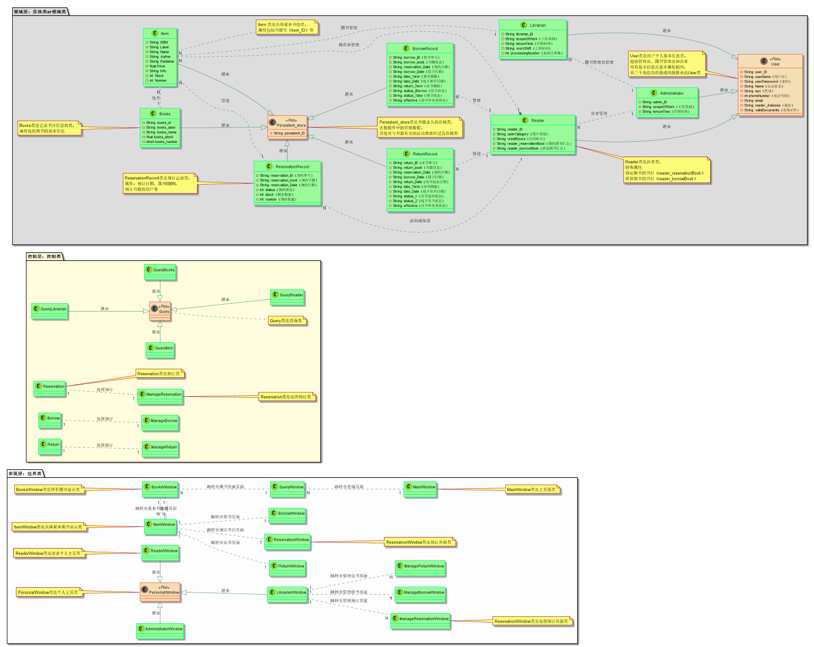
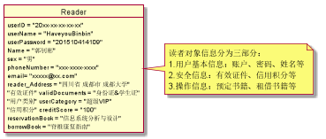
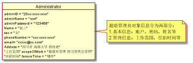
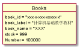
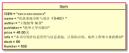

# 实验3：图书管理系统领域对象建模
|学号|班级|姓名|
|:-------:|:-------------: | :----------:|
|201510414109|软件(本)15-1|郭钊彬|

## 1. 图书管理系统的类图

### 1.1 类图PlantUML源码如下：

``` class
@startuml

package Bean <<Cloud>> #DDDDDD {

    skinparam class {
    	BackgroundColor PaleGreen
    	ArrowColor SeaGreen
    	BorderColor SpringGreen
    	BackgroundColor<<Foo>> Wheat
    	BorderColor<<Foo>> Tomato
    }
    skinparam stereotypeCBackgroundColor YellowGreen
    skinparam stereotypeCBackgroundColor<< Foo >> DimGray

    class User<<Foo>>{
        -String  user_ID
        -String  reader_Name
        -String  reader_Sex
    }
    note left:User类是用户个人基本信息类，\n超级管理员，图书管理员和读者\n均有基本信息且基本属性相同，\n故三个角色均直接或间接继承此User类

    class Reader{
        -String  reader_ID
        -String  reader_userName
        -String  reader_Password
        -String  reader_Address
        -String  reader_reservationBook
        -String  reader_borrowBook
    }
    note right:Reader类是读者类，\n特殊属性:\n预定图书的书目（reader_reservationBook）\n所借图书的书目（reader_borrowBook）

    class Administrator{
        -String  admin_ID
        -String  admin_userName
        -String  admin_Password
    }

    class Librarian{
        -String  librarian_ID
        -String  librarian_userName
        -String  librarian_Password
    }
    Reader -left-|> User:继承
    Administrator -up-|> User:继承
    Librarian -up-|> Administrator:继承

    class Books{
        -String  books_ID
        -String  books_Name
        -String  books_Author
        -float books_Price
        -short books_Number
    }
    note left:Books类是记录书目信息的类，\n属性包括图书的基本信息

    class Item{
        -String  item_ID
        -String  item_Name
        -String  item_Author
        -float item_Price
    }
    note right:Item 类是具体某本书的类，\n属性包括书籍号（item_ID）等

    class Reservation{
        -String  reservation_ID
        -String  reservation_UserID
        -String  reservation_ISBN
        -Date  reservation_Date
    }
    note left:Reservation类是预订信息类，\n属性：预订日期、图书ISBN、\n预订书籍的用户等

    class Borrow{
        -String  borrow_ID
        -String  borrow_UserID
        -String  borrow_ISBN
        -Date  borrow_Date
    }

    class Return{
        -String  return_ID
        -String  return_UserID
        -String  return_ISBN
        -Date  return_Date
    }
    class Persistent_store<<Foo>>{
        -String  persistent_ID

    }
    note right:Persistent_store类是书籍永久的存储类，\n在数据库中的存储数据，\n其他对与书籍有关的活动都要经过其存储类

    Books -down-|> Persistent_store:继承
    Item -down-|> Persistent_store:继承
    Books "1" .left.o "N" Item:包含
    Reservation -right-|> Persistent_store:继承
    Borrow -up-|> Persistent_store:继承
    Return -up-|> Persistent_store:继承

    Books "N" .. "1" Reader:查询
    Item "N" ..* "1" Reader:拥有和管理
    Reservation "N" .. "1" Reader:添加或取消
    Borrow "N" .. "1" Reader:管理
    Return "N" .. "1" Reader:管理

    Reader "N" .. "1" Administrator:读者管理
    Librarian "N" .. "1" Administrator:图书管理员管理
    Books "N" .. "1" Librarian:图书管理

    Books "N" .. "1" Reservation:管理

}

@enduml
```

### 1.2. 类图如下：

V1.0版本：


V1.1版本：


### 1.3. 类图说明：
```
1.User类是用户个人基本信息类，超级管理员，图书管理员和读者均有基本信息且基本属性相同，故三个角色均直接或间接继承此User类
2.Reader类是读者类，特殊属性:预定图书的书目（reader_reservationBook），所借图书的书目（reader_borrowBook）。主要操作是：查询、预定、借书和还书
3.Books类是记录书目信息的类，包括书籍的名字（name）、作者（author）、书号（ISBN）等基本信息
4.Item类是具体某本书的类，属性包括书籍号（item_ID）等，操作包括查询、预订、借还书等
5.Reservation类是预订信息类，包括预订日期、图书ISBN、预订书籍的用户等属性
6.Persistent_store类是书籍永久的存储类，在数据库中的存储数据，其他对与书籍有关的活动都要经过其存储类
7.Reader、Librarian和Administrator三个角色均可对用户个人信息等查询修改，但是角色不同，权限也不同；
8.并且，三个角色可以对Books类、Item类、Reservation类、Borrow类和Return类进行管理操作，但是操作的权限和处理会有所不同
9.特别注意的是：Administrator可以对Reader类、Librarian类和Books类进行管理，而Librarian只能对Reader类和Books类进行管理
10.省略类的set/get方法
```

## 2. 图书管理系统的对象图
### 2.1 Reader 读者类
#### 2.1.1 源码如下：
``` class
@startuml
object Reader{
        userID = "20xx-xx-xx-xx-xx"
	 	userName = "HaveyouBinbin"
		userPassword = "201510414109"
		Name = "郭钊彬"
        sex = "男"
        phoneNumber = "xxx-xxxx-xxxx"
        email= "xxxxx@xx.com"
        reader_Address = "四川省 成都市 成都大学"
        "有效证件" validDocuments = "身份证&学生证"
        "用户类别" userCategory = "超级VIP"
        "信用积分" creditScore = "100"
        reservationBook = "信息系统分析与设计"
        borrowBook = "脊椎康复指南"
    }
    note right:读者对象信息分为三部分：\n1.用户基本信息：账户、密码、姓名等\n2.安全信息：有效证件、信用积分等\n3.操作信息：预定书籍、租借书籍等
@enduml
``` 
#### 2.1.2 对象图如下：

#### 2.1.3 说明：
```
读者对象信息分为三部分：
1.用户基本信息：账户、密码、姓名等
2.安全信息：有效证件、信用积分等
3.操作信息：预定书籍、租借书籍等
重点：
1.ID号、电话号码和邮箱等属性的数据结构特点，例如：userID = "20xx-xx-xx-xx-xx"
2.密码等是否需要加密
```

### 2.2 Administrator 超级管理员类
#### 2.2.1 源码如下：
``` class
@startuml
object Administrator{
        adminID = "20xx-xxxx-xxxx"
	 	adminName = "root"
		adminPassword = "123456"
		Name = "张三"
        sex = "女"
        phoneNumber = "xxx-xxxx-xxxx"
        email= "xxxxx@xx.com"
        Address = "四川省 成都大学 教师苑"
        "工作范围" scopeOfWork = "数据库管理 图书管理员管理"
        "任职时间" tenureTime = "10年"
    }
    note right:超级管理员对象信息分为两部分：\n1.基本信息：账户、密码、姓名等\n2.管理信息：工作范围、任职时间等
@enduml
``` 
#### 2.2.2 对象图如下：


#### 2.2.3 说明：
```
超级管理员对象信息分为两部分：
1.基本信息：账户、密码、姓名等
2.管理信息：工作范围、任职时间等
重点：
是否对超级管理员的工作范围进行划分。本对象图是对工作范围进行划分了的
```
### 2.3 Librarian 图书管理员类
#### 2.3.1 源码如下：
``` class
@startuml
object Librarian{
        librarianID = "20xx-xxxx-xxxx"
	 	librarianName = "librarian"
		librarianPassword = "aaa123"
		Name = "李四"
        sex = "男"
        phoneNumber = "xxx-xxxx-xxxx"
        email= "xxxxx@xx.com"
        Address = "四川省 成都大学 成大花园"
        "工作范围" scopeOfWork = "读者管理 图书管理"
        "任职时间" tenureTime = "10年"
        "上班时间" workShift = "9:00-12:00 14:00-17:00"
        "处理订单数" processingNumber = "预定单：10 借书单：20 还书单：30"
    }
    note right:图书管理员对象信息分为两部分：\n1.基本信息：账户、密码、姓名等\n2.管理信息：上班时间、处理订单数等
@enduml
``` 
#### 2.3.2 对象图如下：


#### 2.3.3 说明：
```
图书管理员对象信息分为两部分：
1.基本信息：账户、密码、姓名等
2.管理信息：上班时间、处理订单数等
重点：
记录图书管理员的上班时间，且格式为例如：workShift = "9:00-12:00 14:00-17:00"

```

### 2.4 Books 记录书目信息的类
#### 2.4.1 源码如下：
``` class
@startuml
object Books{
        book_id = "xxx-x-xxx-xxxxx-x"
        book_label = "计算机基础教学教材"
        book_name = "XXX"
        stock = 999
        Number = 100000
    }
@enduml
``` 
#### 2.4.2 对象图如下：


#### 2.4.3 说明：
```
Books类是记录书目信息的类，属性包括图书的基本信息
注意：
属性值是否为字符串
例如：book_id = "xxx-x-xxx-xxxxx-x" 和 stock = 999 的区别
```
### 2.5 Item 具体某本书的类
#### 2.5.1 源码如下：
``` class
@startuml
object Item{
        ISBN = "xxx-x-xxx-xxxxx-x"
        name = "信息系统分析与设计（第4版）"
        author = "王晓敏等 编著"
        publisher = "清华大学出版社"
        price = 45.00元
        info = "本书可用作信息管理与信息系统、计算机应用、软件工程等专业的教材"
        stock = 88
        Number = 500
    }
@enduml
``` 
#### 2.5.2 对象图如下：


#### 2.5.3 说明：
```
Item 类是具体某本书的类，属性包括书籍号（item_ID）等
注意：ISBN = "xxx-x-xxx-xxxxx-x"的格式要求，以及这个ISBN号作为ID号
```
### 2.5 Reservation 预订信息类
#### 2.5.1 源码如下：
``` class
@startuml
object Reservation{
        "预约单号"reservation_ID = "xx-xxx-xxx-xx"
        "读者ID" user_ID = "20xx-xx-xx-xx-xx"
        "预约书籍" reservation_book = "信息系统分析与设计（第4版）"
        "ISBN号" ISBN = "xxx-x-xxx-xxxxx-x"
        "预约日期" reservation_Date = 2018-04-12 8:55:00
        "预约状态" status = 0
        "剩余数量"stock = 0
        "预约数量" number = 9
}

@enduml
``` 
#### 2.5.2 对象图如下：


#### 2.5.3 说明：
```
Reservation类是预订信息类，属性：预订日期、图书ISBN、预订书籍的用户等
注意：
1.属性"读者ID" user_ID = "20xx-xx-xx-xx-xx"来自此预约书籍的读者Reader类的ID号
2.属性 "ISBN号" ISBN = "xxx-x-xxx-xxxxx-x"来自Item的ISBN号
3."预约状态" status = 0 表示预约失败！ status = 1 表示预约成功！

```

### 其他类对象图与以上对象图相似，不再叙述......