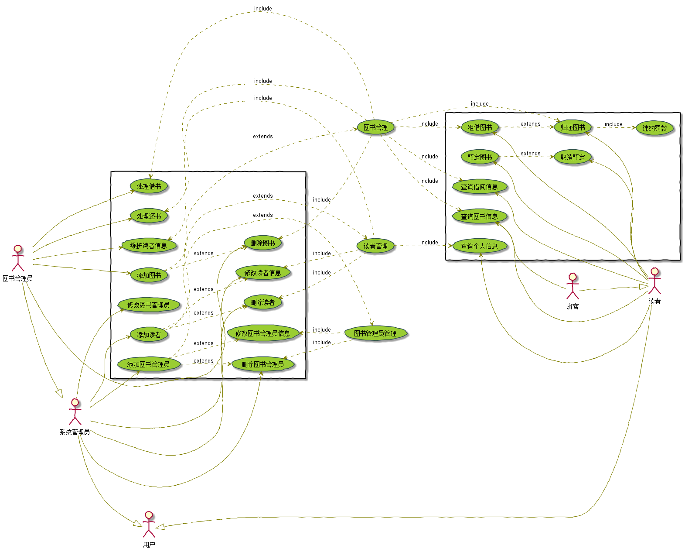
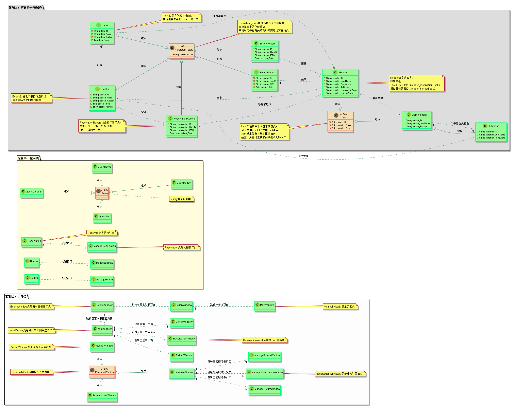
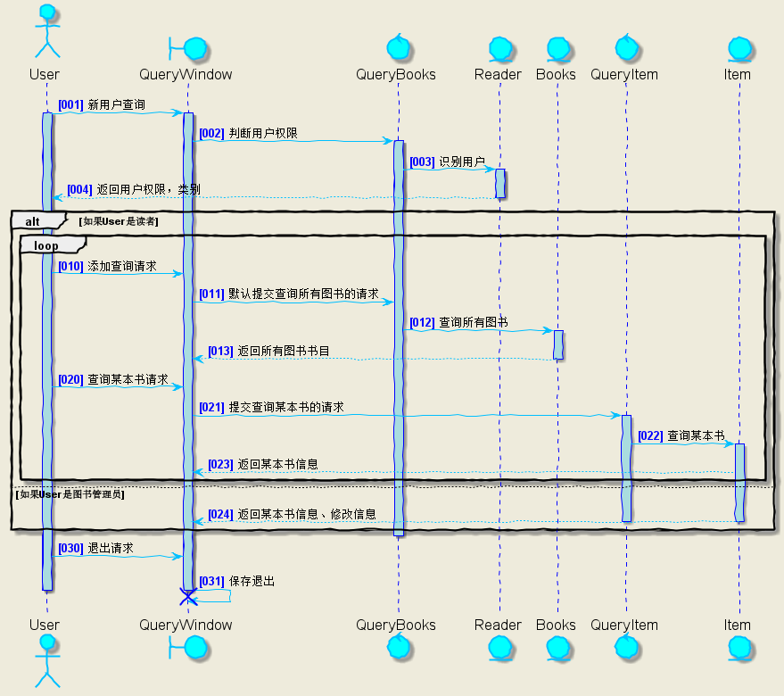
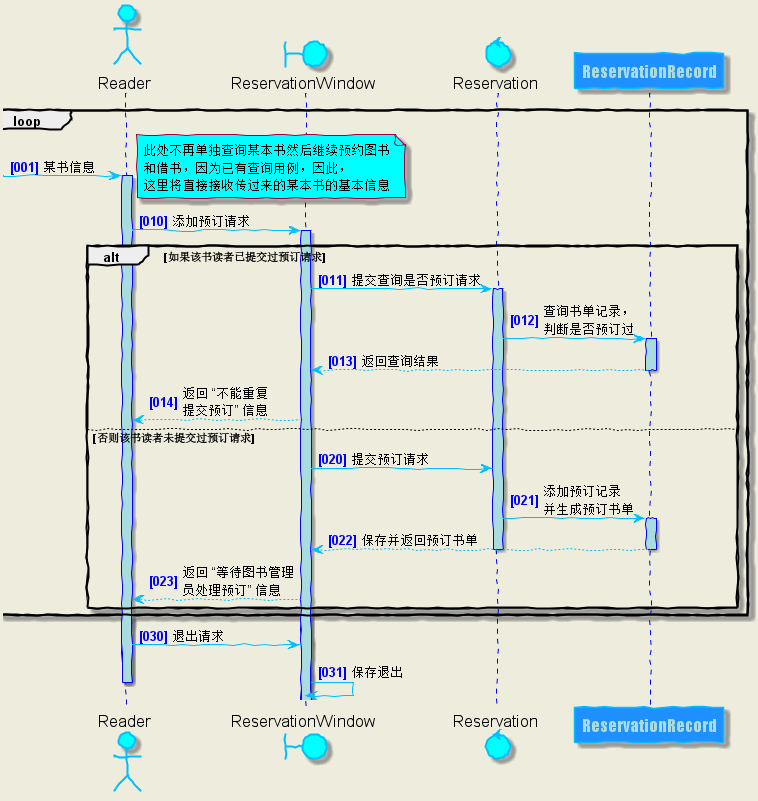
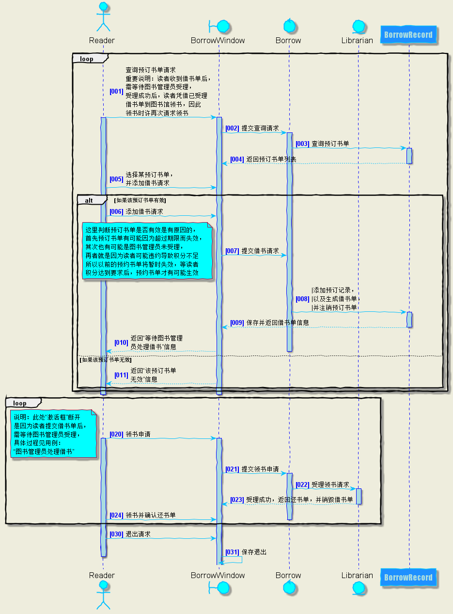
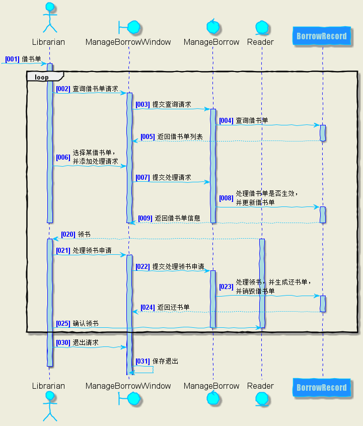
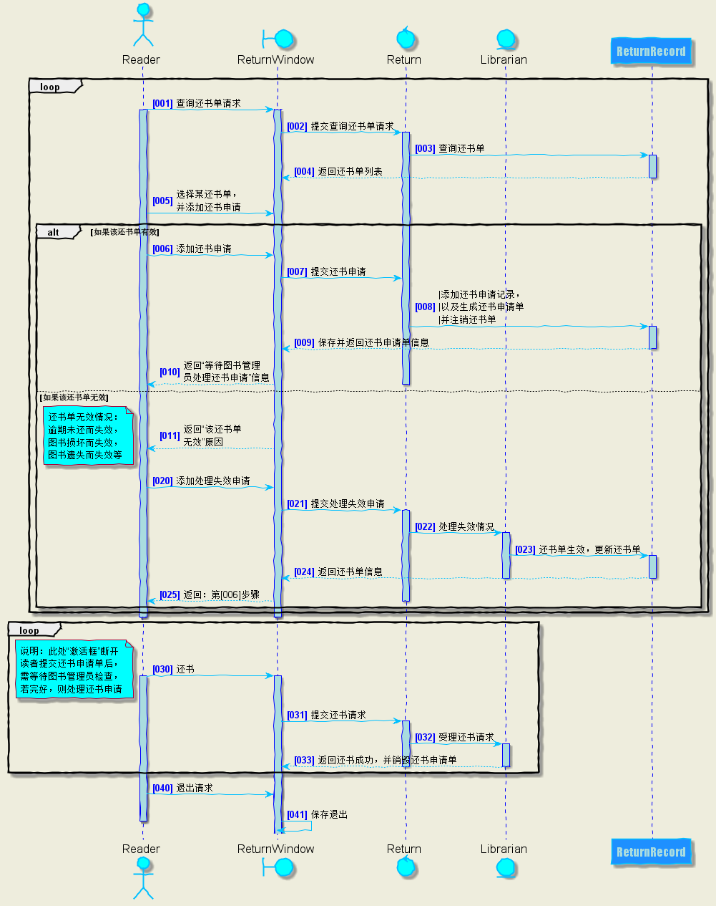

# 实验4：图书管理系统顺序图绘制
|学号|班级|姓名|
|:-------:|:-------------: | :----------:|
|201510414109|软件(本)15-1|郭钊彬|

# 重要说明：

## 在做时序图时发现前面test2和test3设计的用例图和类图有瑕疵！
## 正如书上P212页所说：根据用例图设计时序图时，只要存在参与者交互，
## 都应该建立一个用例界面类，然后根据架构分层决定是否需要控制类
## 故对test2和test3进行了重新设计，更新的版本如下：

### test2用例图V1.1版本如下：


### test3类图V1.1版本如下：


====================================分隔符======================================

## 图书管理系统的顺序图

## 1. 查询某本图书用例

### 1.1 查询某本图书用例时序图PlantUML源码如下：

``` class
@startuml
skinparam backgroundColor #EEEBDC
skinparam handwritten true

skinparam sequence {
	ArrowColor DeepSkyBlue
	ActorBorderColor DeepSkyBlue
	LifeLineBorderColor blue
	LifeLineBackgroundColor #A9DCDF

	ParticipantBorderColor DeepSkyBlue
	ParticipantBackgroundColor DodgerBlue
	ParticipantFontName Impact
	ParticipantFontSize 17
	ParticipantFontColor #A9DCDF

	ActorBackgroundColor aqua
	ActorFontSize 17
	ActorFontName Aapex
}

actor User as U
boundary QueryWindow as Q
control QueryBooks as QB
entity Reader as R
entity Books as B
control QueryItem as QI
entity Item as I

autonumber 1 "<font color=blue><b>[000]"
U -> Q: 新用户查询
activate U
activate Q
Q -> QB: 判断用户权限
activate QB
QB -> R: 识别用户
activate R
R --> U:返回用户权限，类别
deactivate R

alt 如果User是读者
    loop
        autonumber 10 "<font color=blue><b>[000]"
        U -> Q: 添加查询请求
        Q -> QB: 默认提交查询所有图书的请求
        QB -> B: 查询所有图书
        activate B
        B --> Q: 返回所有图书书目
        deactivate B
        autonumber 20 "<font color=blue><b>[000]"
        U -> Q: 查询某本书请求
        Q -> QI: 提交查询某本书的请求
        activate QI
        QI -> I: 查询某本书
        activate I
        I --> Q: 返回某本书信息
    end
else 如果User是图书管理员
    I --> Q: 返回某本书信息、修改信息
    deactivate I
    deactivate QI
end
deactivate QB

autonumber 30 "<font color=blue><b>[000]"
U -> Q: 退出请求
Q -> Q: 保存退出
deactivate U
destroy Q

@enduml
```

### 1.2. 查询某本图书用例时序图如下：



### 1.3. 时序图说明：
```
1.查询操作很多，用户不同，查询权限不同，查询的内容也不相同，均要做相关判断
2.用户有图书管理员和读者等，因此一开始就需要判断actor User是读者还是图书管理员
3.无论是读者还是图书管理员，均默认先查询所有图书，并返回图书列表，
用户再根据列表选择查询的某本书，最后才根据不同用户返回不同信息
```

## 2. 预订图书用例

### 2.1 预订图书用例时序图PlantUML源码如下：

``` class
@startuml
skinparam backgroundColor #EEEDDD
skinparam handwritten true

skinparam sequence {
	ArrowColor DeepSkyBlue
	ActorBorderColor DeepSkyBlue
	LifeLineBorderColor blue
	LifeLineBackgroundColor #A9DCDF

	ParticipantBorderColor DeepSkyBlue
	ParticipantBackgroundColor DodgerBlue
	ParticipantFontName Impact
	ParticipantFontSize 17
	ParticipantFontColor #A9DCDF

	ActorBackgroundColor aqua
	ActorFontSize 17
	ActorFontName Aapex
}

actor Reader as R
boundary ReservationWindow as RW
control Reservation as Ra
Participant ReservationRecord as RR

loop
    autonumber "<font color=blue><b>[000]"
     -> R: 某书信息
    note left #aqua: 此处不再单独查询某本书然后继续预约图书\n和借书，因为已有查询用例，因此，\n这里将直接接收传过来的某本书的基本信息
    activate R
    autonumber 10 "<font color=blue><b>[000]"
    R -> RW:添加预订请求
    activate RW
    alt 如果该书读者已提交过预订请求
        RW -> Ra:提交查询是否预订请求
        activate Ra
        Ra -> RR:查询书单记录，\n判断是否预订过
        activate RR
        RR --> RW:返回查询结果
        deactivate RR
        RW --> R:返回 “不能重复\n提交预订” 信息
    else 否则该书读者未提交过预订请求
        autonumber 20 "<font color=blue><b>[000]"
        RW -> Ra:提交预订请求
        Ra -> RR:添加预订记录\n并生成预订书单
        activate RR
        RR --> RW:保存并返回预订书单
        deactivate RR
        deactivate Ra
        RW --> R:返回 “等待图书管理\n员处理预订” 信息
    end
end

autonumber 30 "<font color=blue><b>[000]"
R -> RW: 退出请求
RW -> RW: 保存退出
deactivate R

@enduml
```

### 2.2. 预订图书用例时序图如下：



### 2.3. 时序图说明：
```
1.预订图书不再单独查询某本书然后继续预约，因为已有查询用例，因此，这里将直接接收传过来的某本书的基本信息
2.因为读者有可能以及提交过预订请求，因此再次提交申请时须做出判断
3.预订图书申请提交用户不能立马预订成功，须等待图书管理员核查读者是否能预订，如果能则生效，负责无效
```

## 3. 读者借书用例

### 3.1 读者借书用例时序图PlantUML源码如下：

``` class
@startuml
skinparam backgroundColor #EEEDDD
skinparam handwritten true

skinparam sequence {
	ArrowColor DeepSkyBlue
	ActorBorderColor DeepSkyBlue
	LifeLineBorderColor blue
	LifeLineBackgroundColor #A9DCDF

	ParticipantBorderColor DeepSkyBlue
	ParticipantBackgroundColor DodgerBlue
	ParticipantFontName Impact
	ParticipantFontSize 17
	ParticipantFontColor #A9DCDF

	ActorBackgroundColor aqua
	ActorFontSize 17
	ActorFontName Aapex
}

actor Reader as R
boundary BorrowWindow as BW
control Borrow as B
entity Librarian as L
Participant BorrowRecord as BR

loop
    autonumber "<font color=blue><b>[000]"
    R -> BW:查询预订书单请求  \n重要说明：读者收到借书单后，\n需等待图书管理员受理，\n受理成功后，读者凭借已受理\n借书单到图书馆领书，因此\n领书时许再次请求领书
    activate R
    activate BW
    BW -> B:提交查询请求
    activate B
    B -> BR:查询预订书单
    activate BR
    BR --> BW:返回预订书单列表
    deactivate BR
    R -> BW: 选择某预订书单，\n并添加借书请求
    alt 如果该预订书单有效
        R -> BW:添加借书请求
        BW -> B:提交借书请求
        note left #aqua: 这里判断预订书单是否有效是有原因的，\n首先预订书单有可能因为超过期限而失效，\n其次也有可能是图书管理员未受理，\n再者就是因为读者可能违约导致积分不足\n所以以前的预约书单将暂时失效，等读者\n积分达到要求后，预约书单才有可能生效
        B -> BR:|添加预订记录，\n|以及生成借书单，\n|并注销预订书单
        activate BR
        BR --> BW:保存并返回借书单信息
        deactivate BR
        BW --> R:返回“等待图书管理\n员处理借书”信息
        deactivate B
    else 如果该预订书单无效
        BW --> R:返回“该预订书单\n无效”信息
    end
end
deactivate R
deactivate BW

loop
    autonumber 20 "<font color=blue><b>[000]"
    R -> BW:领书申请
    note left #aqua:说明：此处“激活框”断开\n是因为读者提交借书单后，\n需等待图书管理员受理，\n具体过程见用例：\n“图书管理员处理借书”
    activate R
    activate BW
    BW -> B:提交领书申请
    activate B
    B -> L:受理领书请求
    activate L
    L --> BW:受理成功，返回还书单，并销毁借书单
    deactivate L
    R -> BW:领书并确认还书单
    deactivate B
end

autonumber 30 "<font color=blue><b>[000]"
R -> BW: 退出请求
BW -> BW: 保存退出
deactivate R
@enduml
```

### 3.2. 读者借书用例时序图如下：



### 3.3. 时序图说明：
```
1.读者收到借书单后，需等待图书管理员受理，受理成功后，读者凭借已受理借书单到图书馆领书，因此领书时许再次请求领书
2.需要判断预订书单是否有效：
    2.1.首先预订书单有可能因为超过期限而失效；
    2.2.其次也有可能是图书管理员未受理；
    2.3.再者就是因为读者可能违约导致积分不足所以以前的预约书单将暂时失效，等读者积分达到要求后，预约书单才有可能生效
3.图中“激活框”断开是因为读者提交借书单后，需等待图书管理员受理，具体过程见用例：“图书管理员处理借书”
```

## 4. 图书管理员处理借书用例

### 4.1 图书管理员处理借书用例时序图PlantUML源码如下：

``` class
@startuml
skinparam backgroundColor #EEEDDD
skinparam handwritten true

skinparam sequence {
	ArrowColor DeepSkyBlue
	ActorBorderColor DeepSkyBlue
	LifeLineBorderColor blue
	LifeLineBackgroundColor #A9DCDF

	ParticipantBorderColor DeepSkyBlue
	ParticipantBackgroundColor DodgerBlue
	ParticipantFontName Impact
	ParticipantFontSize 17
	ParticipantFontColor #A9DCDF

	ActorBackgroundColor aqua
	ActorFontSize 17
	ActorFontName Aapex
}

actor Librarian as L
boundary ManageBorrowWindow as MBW
control ManageBorrow as MB
entity Reader as R
Participant BorrowRecord as BR

autonumber "<font color=blue><b>[000]"
-> L:借书单
activate L
loop
    L -> MBW:查询借书单请求
    activate MBW
    MBW -> MB:提交查询请求
    activate MB
    MB -> BR:查询借书单
    activate BR
    BR --> MBW:返回借书单列表
    deactivate BR
    L -> MBW: 选择某借书单，\n并添加处理请求
    MBW -> MB:提交处理请求
    MB -> BR:处理借书单是否生效，\n并更新借书单
    activate BR
    BR --> MBW:返回借书单信息
    deactivate BR
    deactivate MB
    deactivate L
    deactivate MBW

    autonumber 20 "<font color=blue><b>[000]"
    R --> L:领书
    activate R
    activate L
    L -> MBW:处理领书申请
    activate MBW
    MBW -> MB:提交处理领书申请
    activate MB
    MB -> BR:处理领书，并生成还书单，\n并销毁借书单
    activate BR
    BR --> MBW:返回还书单
    deactivate BR
    L -> R:确认领书
    deactivate MB
    deactivate R
end

autonumber 30 "<font color=blue><b>[000]"
L -> MBW: 退出请求
MBW -> MBW: 保存退出
deactivate L
@enduml
```

### 4.2. 图书管理员处理借书用例时序图如下：



### 4.3. 时序图说明：
```
1.这里使用loop循环是因为图书管理员需循环处理借书请求
2.首先需要查询借书单，如何处理读者是否可以预订，如何处理借书单是否生效，并更新借书单
3.这个时序图中最重要的是：要与读者类协作：
例如：读者发出领书请求，图书管理员处理领书，生成还书单，并销毁借书单，接着返回还书单，最后读者确认领书
```

## 5. 读者还书用例

### 5.1 读者还书用例时序图PlantUML源码如下：

``` class
@startuml
skinparam backgroundColor #EEEDDD
skinparam handwritten true

skinparam sequence {
	ArrowColor DeepSkyBlue
	ActorBorderColor DeepSkyBlue
	LifeLineBorderColor blue
	LifeLineBackgroundColor #A9DCDF

	ParticipantBorderColor DeepSkyBlue
	ParticipantBackgroundColor DodgerBlue
	ParticipantFontName Impact
	ParticipantFontSize 17
	ParticipantFontColor #A9DCDF

	ActorBackgroundColor aqua
	ActorFontSize 17
	ActorFontName Aapex
}

actor Reader as R
boundary ReturnWindow as RW
control Return as Re
entity Librarian as L
Participant ReturnRecord as RR

loop
    autonumber "<font color=blue><b>[000]"
    R -> RW:查询还书单请求
    activate R
    activate RW
    RW -> Re:提交查询还书单请求
    activate Re
    Re -> RR:查询还书单
    activate RR
    RR --> RW:返回还书单列表
    deactivate RR
    R -> RW: 选择某还书单，\n并添加还书申请
    alt 如果该还书单有效
        R -> RW:添加还书申请
        RW -> Re:提交还书申请
        Re -> RR:|添加还书申请记录，\n|以及生成还书申请单\n|并注销还书单
        activate RR
        RR --> RW:保存并返回还书申请单信息
        deactivate RR
        RW --> R:返回“等待图书管理\n员处理还书申请”信息
        deactivate Re
    else 如果该还书单无效
        RW --> R:返回“该还书单\n无效”原因
        note left #aqua: 还书单无效情况：\n逾期未还而失效，\n图书损坏而失效，\n图书遗失而失效等
        autonumber 20 "<font color=blue><b>[000]"
        R -> RW:添加处理失效申请
        RW -> Re:提交处理失效申请
        activate Re
        Re -> L:处理失效情况
        activate L
        L -> RR:还书单生效，更新还书单
        activate RR
        RR --> RW:返回还书单信息
        deactivate RR
        deactivate L
        RW --> R:返回：第[006]步骤
        deactivate Re
    end
end
deactivate R
deactivate RW

loop
    autonumber 30 "<font color=blue><b>[000]"
    R -> RW:还书
    note left #aqua:说明：此处“激活框”断开\n读者提交还书申请单后，\n需等待图书管理员检查，\n若完好，则处理还书申请
    activate R
    activate RW
    RW -> Re:提交还书请求
    activate Re
    Re -> L:受理还书请求
    activate L
    L --> RW:返回还书成功，并销毁还书申请单
    deactivate L
    deactivate Re
end

autonumber 40 "<font color=blue><b>[000]"
R -> RW: 退出请求
RW -> RW: 保存退出
deactivate R
@enduml
```

### 5.2. 读者还书用例时序图如下：



### 5.3. 时序图说明：
```
1.还书单无效情况：逾期未还而失效，图书损坏而失效，图书遗失而失效等
2.“激活框”断开原因：读者提交还书申请单后，需等待图书管理员检查，若完好，则处理还书申请
3.重要说明：此时序图需要与图书管理员类协作完成：
例如：读者提交还书请求，图书管理员判断该还书单是否有效，若有效，则添加还书申请记录，
以及生成还书申请单并注销还书单，保存并返回还书申请单信息，读者等待图书管理员处理还书
```

### 其他时序图与以上时序图相似，不再叙述......