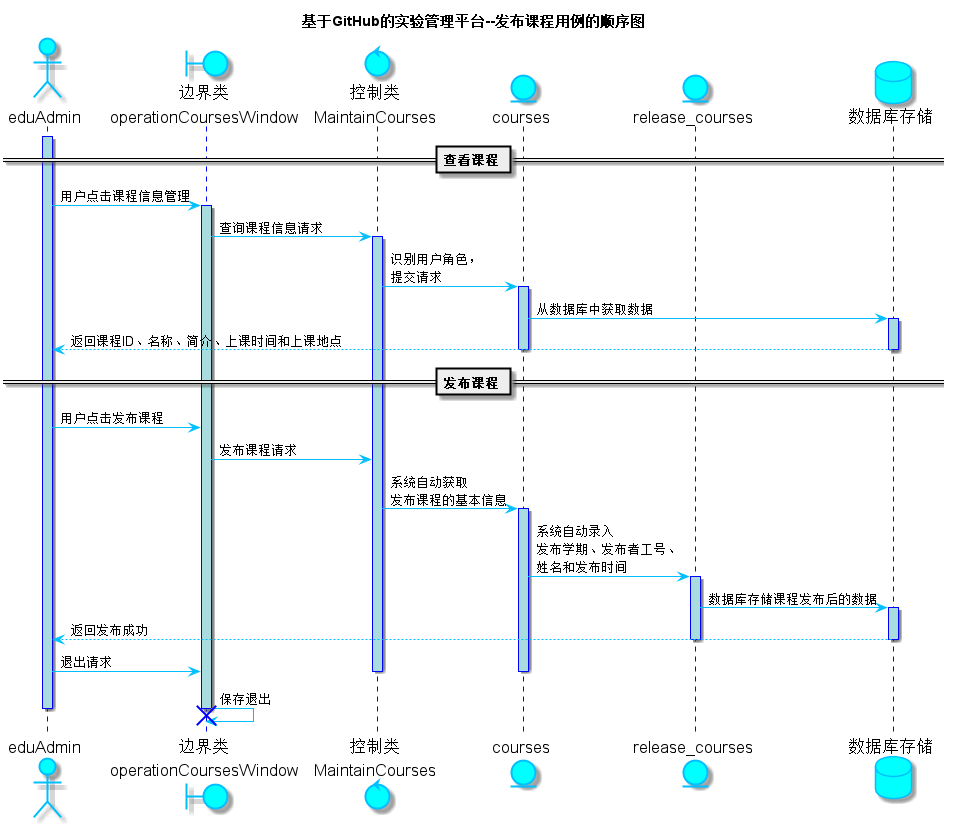

<!-- markdownlint-disable MD033-->
<!-- 禁止MD033类型的警告 https://www.npmjs.com/package/markdownlint -->

# “发布课程”用例 [返回](../README.md)
## 1. 用例规约

|用例名称|发布课程|
|-------|:-------------|
|功能|教务管理员发布一个课程|
|参与者|教务管理员|
|前置条件|查看课程：发布课程之前，老师需要先登录，并列表显示课程的信息|
|后置条件| 发布课程完成之后，系统自动更新发布课程日期为当前日期，该课程变为已发布未被选课状态|
|主事件流| 1. 查看已有的课程列表   2.点击发布 3. 系统自动给该课程设置发布教务管理员的工号和姓名  4. 显示详情  5.教务管理员查看信息，确认发布  6. 发布成功，跳转至原来课程列表页面|
|备选事件流|2a. 可选择发布学期，不选择则系统默认为当前学期  &nbsp;&nbsp; 1.提示用户未选择发布学期，系统已默认为当前学期|

## 2. 业务流程（顺序图） [源码](../src/sequence发布课程.puml)

    
## 3. 界面设计
- 界面参照: https://haveyoubinbin.github.io/is_analysis/test6/ui/发布课程.html

- API接口调用

    - 接口1：[getOneCourses](../接口/getOneCourses.md)

        用于获取课程ID、选择该课程的教师工号和选择该课程的学生学号等信息
        
    - 接口2：[getOneReleaseCourses](../接口/getOneReleaseCourses.md)
        
        用于显示一门已发布未被选课状态的课程的信息以及发布者工号和姓名
         
    - 接口3：[setOneReleaseCourses](../接口/setOneReleaseCourses.md)
    
        用于系统自动设置一门课程的发布学期、发布者工号、姓名和发布时间
    
## 4. 算法描述
    无
    
## 5. 参照表

- [COURSES](../数据库设计.md/#COURSES)
- [EDUADMIN](../数据库设计.md/#EDUADMIN)
- [USERS](../数据库设计.md/#USERS)

