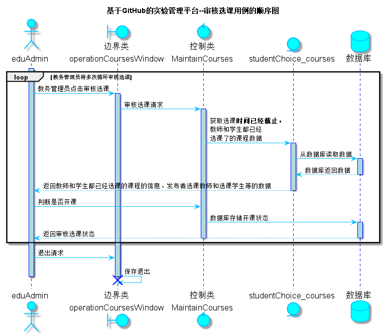

<!-- markdownlint-disable MD033-->
<!-- 禁止MD033类型的警告 https://www.npmjs.com/package/markdownlint -->

# “审核选课”用例 [返回](../README.md)
## 1. 用例规约

|用例名称|审核选课|
|-------|:-------------|
|功能|教务管理员审核一个已被教师和学生选了的课程是否可以开课，满足条件则开课，不满足则取消该课程|
|参与者|教务管理员|
|前置条件|审核选课之前，教务管理员需要先登录，选课时间已经截止， 同时教师和学生已经选课了，并列表显示已被选课的课程的信息|
|后置条件| 审核选课完成之后，教务管理员根据规则判断是否开课 若满足条件（如学生人数超过15人）则教务管理员点击开课 若不满足条件（如学生人数少于15人）则教务管理员取消该课程|
|主事件流| 1. 教务管理员查看选课时间已经截止的课程列表   2.点击审核 3. 显示详情  4.课程选课学生人数满足条件开课  5. 开课成功，跳转至审核课程列表页面|
|备选事件流|2a. 课程选课学生人数不满足条件  &nbsp;&nbsp; 1.取消该课程，跳转至审核课程列表页面|

## 2. 业务流程（顺序图） [源码](../src/sequence审核选课.puml)

    
## 3. 界面设计
- 界面参照: https://haveyoubinbin.github.io/is_analysis/test6/ui/审核选课.html

- API接口调用

     - 接口1：[getOneStudentChoiceCourses](../接口/getOneStudentChoiceCourses.md)

        用于获取一门已选课时间已经截止，并且被教师和学生都选择了的课程的信息

    - 接口2：[setOneStudentChoiceCourses](../接口/setOneStudentChoiceCourses.md)

        用于设置一门已选课时间已经截止，并且被教师和学生都选择了的课程是否可以开课
    
## 4. 算法描述
    无
    
## 5. 参照表

- [STUDENTCHOICE_COURSES](../数据库设计.md/#STUDENTCHOICE_COURSES)
- [EDUADMIN](../数据库设计.md/#EDUADMIN)
- [USERS](../数据库设计.md/#USERS)

