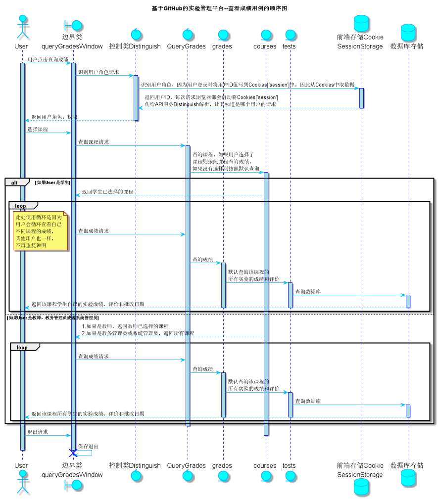

<!-- markdownlint-disable MD033-->
<!-- 禁止MD033类型的警告 https://www.npmjs.com/package/markdownlint -->

# “查看成绩”用例 [返回](../README.md)
## 1. 用例规约

|用例名称|查看成绩|
|-------|:-------------|
|功能|用户查看自己课程的总成绩及每个实验的实验成绩及实验评价|
|参与者|学生，教师，教务管理员，系统管理员|
|前置条件|学生，教师，教务管理员，系统管理员需要先登录|
|后置条件|跳转至该课程的成绩页面|
|主事件流| |
|备选事件流| |

## 2. 业务流程（顺序图） [源码](../src/sequence查看成绩.puml)

## 3. 界面设计
- 界面参照: https://zwdbox.github.io/is_analysis/test6/ui/查看成绩.html
- API接口调用
    - 接口1：[getOneCourses](../接口/getOneCourses.md)
    - 接口2：[getOneStudentResults](../接口/getOneStudentResults.md)

## 4. 算法描述
    无
    
## 5. 参照表
- [GRADES](../数据库设计.md/#GRADES)
- [TESTS](../数据库设计.md/#TESTS)
- [COURSES](../数据库设计.md/#COURSES)
- [STUDENTS](../数据库设计.md/#STUDENTS)
- [TEACHERS](../数据库设计.md/#TEACHERS)
- [EDUADMIN](../数据库设计.md/#EDUADMIN)
- [SYSADMIN](../数据库设计.md/#SYSADMIN)
- [USERS](../数据库设计.md/#USERS)
