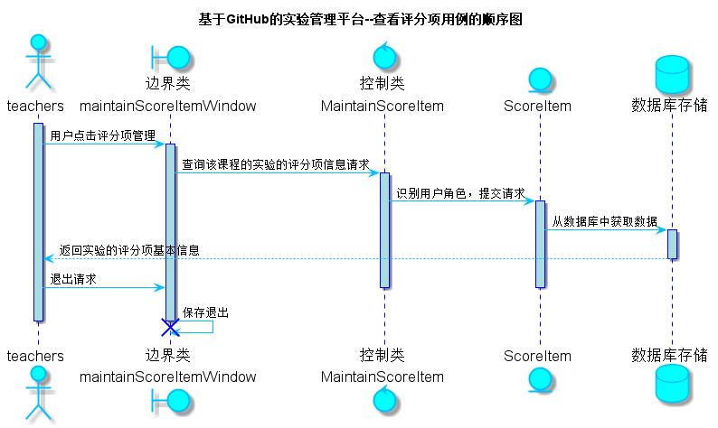

<!-- markdownlint-disable MD033-->
<!-- 禁止MD033类型的警告 https://www.npmjs.com/package/markdownlint -->

# “查看评分项”用例 [返回](../README.md)
## 1. 用例规约

|用例名称|查看评分项|
|-------|:-------------|
|功能|查看评分项的所有信息|
|参与者|教师|
|前置条件|教师必须先登录|
|后置条件|跳转至显示评分项信息页面|
|主事件流||
|备选事件流| |

## 2. 业务流程（顺序图） [源码](../src/sequence查看评分项.puml)

## 3. 界面设计
- 界面参照: https://haveyoubinbin.github.io/is_analysis/test6/ui/查看评分项.html
- API接口调用
    - 接口1：[getOneScoreItems](../接口/getOneScoreItems.md)

        用于获取课程的实验的评分项信息

## 4. 算法描述
无

## 5. 参照表
- [TEACHERS](../数据库设计.md/#TEACHERS)
- [USERS](../数据库设计.md/#USERS)
- [SCOREITEMS](../数据库设计.md/#SCOREITEMS)
