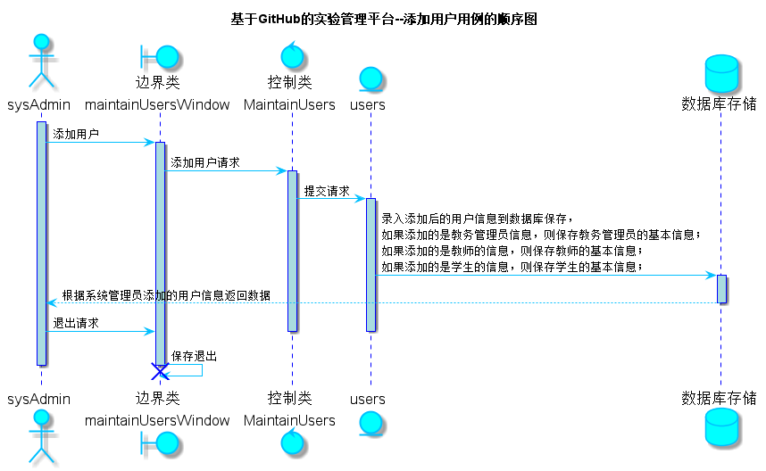

<!-- markdownlint-disable MD033-->
<!-- 禁止MD033类型的警告 https://www.npmjs.com/package/markdownlint -->

# “添加用户”用例 [返回](../README.md)
## 1. 用例规约

|用例名称|添加用户|
|-------|:-------------|
|功能|添加用户的基本信息|
|参与者|系统管理员|
|前置条件|系统管理员必须先登录|
|后置条件|跳转至添加用户列表页面|
|主事件流||
|备选事件流| |

## 2. 业务流程（顺序图） [源码](../src/sequence添加用户.puml)

## 3. 界面设计
- 界面参照: https://haveyoubinbin.github.io/is_analysis/test6/ui/添加用户.html
- API接口调用
    - 接口1：[getOneUsers](../接口/getOneUsers.md)

        用于获取用户信息，用户包括教务管理员、教师和学生

    - 接口2：[setOneUsers](../接口/setOneUsers.md)

        用于添加、修改和删除用户信息，用户包括教务管理员、教师和学生

## 4. 算法描述
无

## 5. 参照表
- [SYSADMIN](../数据库设计.md/#SYSADMIN)
- [USERS](../数据库设计.md/#USERS)
