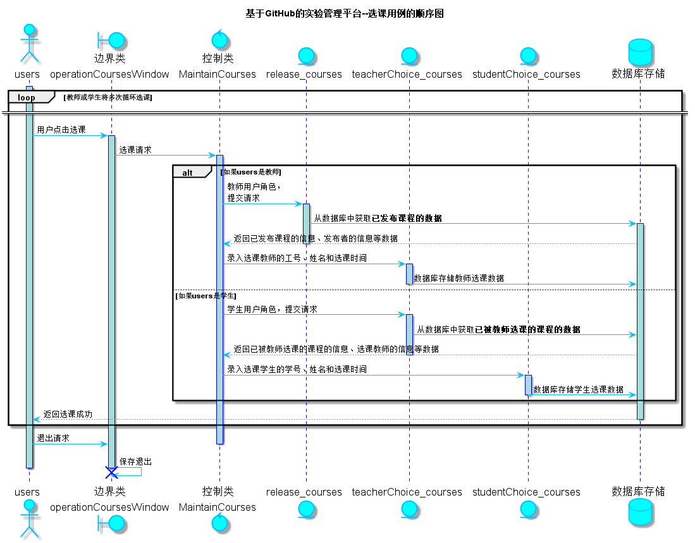

<!-- markdownlint-disable MD033-->
<!-- 禁止MD033类型的警告 https://www.npmjs.com/package/markdownlint -->

# “选课”用例 [返回](../README.md)
## 1. 用例规约

|用例名称|选课|
|-------|:-------------|
|功能|教师或学生选择一个课程|
|参与者|教师，学生|
|前置条件|查看发布课程：选课之前，教师或学生需要先登录，并列表显示课程的信息|
|后置条件| 选课完成之后，系统自动更新选课日期为当前日期 如果是教师选课，该课程变为教师已选课学生未选课状态 如果是学生选课，该课程变为教师已选课学生已选课状态|
|主事件流| 1. 教师查看已发布课程列表，学生查看教师已选课的课程列表   2.点击选课 3. 系统自动给该课程设置选课教师或学生的工号（学号）和姓名  4. 显示详情  5.教师或学生查看信息，确认选课  6. 选课成功，跳转至选课页面|
|备选事件流|2a. 课程列表为空  &nbsp;&nbsp; 1.提示教师无发布课程信息，请教师等待课程发布后再来选课 &nbsp;&nbsp; 2.提示学生无教师已选课的课程信息，请学生等待教师选课后再来选课|

## 2. 业务流程（顺序图） [源码](../src/sequence选课.puml)

    
## 3. 界面设计
- 界面参照: https://haveyoubinbin.github.io/is_analysis/test6/ui/选课.html

- API接口调用

    - 接口1：[getOneReleaseCourses](../接口/getOneReleaseCourses.md)
        
        用于获取一门已发布未被选课状态的课程的信息以及发布者工号和姓名

    - 接口2：[setOneTeacherChoiceCourses](../接口/setOneTeacherChoiceCourses.md)

        用于系统自动设置一门已发布课程的选课教师工号、姓名和选课时间

    - 接口3：[getOneTeacherChoiceCourses](../接口/getOneTeacherChoiceCourses.md)

        用于获取一门已被教师选课但未被学生选课状态的课程的信息以及选课教师的工号和姓名

    - 接口4：[setOneStudentChoiceCourses](../接口/setOneStudentChoiceCourses.md)

        用于系统自动设置一门已被教师选课的课程的选课学生学号、姓名和选课时间
    
## 4. 算法描述
    无
    
## 5. 参照表

- [COURSES](../数据库设计.md/#COURSES)
- [RELEASE_COURSES](../数据库设计.md/#RELEASE_COURSES)
- [TEACHERCHOICE_COURSES](../数据库设计.md/#TEACHERCHOICE_COURSES)
- [STUDENTCHOICE_COURSES](../数据库设计.md/#STUDENTCHOICE_COURSES)
- [TEACHERS](../数据库设计.md/#TEACHERS)
- [STUDENTS](../数据库设计.md/#STUDENTS)
- [USERS](../数据库设计.md/#USERS)

