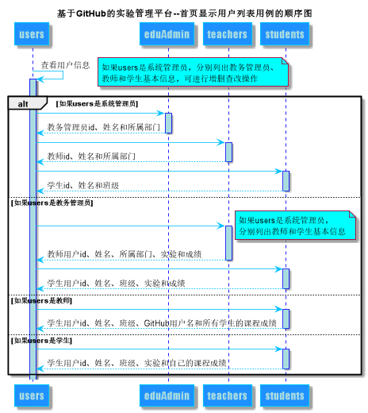

<!-- markdownlint-disable MD033-->
<!-- 禁止MD033类型的警告 https://www.npmjs.com/package/markdownlint -->

# “首页显示用户列表”用例 [返回](../README.md)
## 1. 用例规约

|用例名称|首页显示用户列表|
|-------|:-------------|
|功能|根据用户类型以表形式的显示出用户的信息|
|参与者|学生，教师，教务管理员，系统管理员|
|前置条件|学生，教师，教务管理员，系统管理员需要先登录|
|后置条件|1.若是系统管理员，则分别显示教务管理员、教师和学生的信息列表，可进行增删查改操作。 2.若是教务管理员，则分别显示教师和学生的信息列表。 3.若是教师，则显示学生的信息列表和选择该教师课程的所有学生的课程成绩。 4.若是学生，则显示学生的信息和自己课程成绩。 |
|主事件流| |
|备选事件流| |

## 2. 业务流程（顺序图） [源码](../src/sequence首页显示用户列表.puml)

## 3. 界面设计
- 界面参照: https://haveyoubinbin.github.io/is_analysis/test6/ui/index.html
- API接口调用
    - 接口1：[getStudents](../接口/getStudents.md)
    - 接口2：[getTeachers](../接口/getTeachers.md)
    - 接口3：[getEDUAdmin](../接口/EDUAdmin.md)

## 4. 算法描述

- WEB_SUM解析为列表  
  - WEB_SUM是接口getStudents的返回值中的一部分，形如："WEB_SUM": "Y,Y,Y,Y,Y,N"。需要在前端进行解析。  
  - 作用是判断GitHub网址是否正确，用逗号分开，Y代表正确，N代表不正确。  
  - 第1位代表总的GitHUB地址是否正确，第2位表示第1次实验的地址，第3位表示第2位实验地址，依此类推。
  - 比如：“Y,Y,Y,Y,Y,N”表示第5次实验地址不正确，其他地址正确。  
  - 算法是使用使用字符串分离方法将其分开。

- RESULT_SUM解析为列表
    - RESULT_SUM是接口getStudents的返回值中的一部分，形如："RESULT_SUM": "81.25,70,80,85,90,N"。需要在前端进行解析。
    - 成绩汇总（来自学生课程成绩表GRADES）。以逗号分开，第一个是课程代码，第二个是教室工号（因为有的一个课程有两个教师， 不同班级，比如这学期我们12班和34班的android课程的老师不是同一个）第三个成绩是课程总成绩（加权平均分）, 第四个是实验1的成绩（评分项得分之和），后面是每个评分项的得分，后续实验以此类推。其中若实验成绩为N则表示未批改， 课程总成绩只计算已批改的。比如：“81.25,70,80,85,90,N”表示一共批改了4次，第5次未批改， 4次的成绩分别是81.25,70,80,85,90,N，4次的平均分是81.25
    - 算法是使用使用字符串分离方法将其分开。
    
## 5. 参照表

- [STUDENTS](../数据库设计.md/#STUDENTS)
- [TEACHERS](../数据库设计.md/#TEACHERS)
- [EDUADMIN](../数据库设计.md/#EDUADMIN)
- [GRADES](../数据库设计.md/#GRADES)
- [TESTS](../数据库设计.md/#TESTS)

